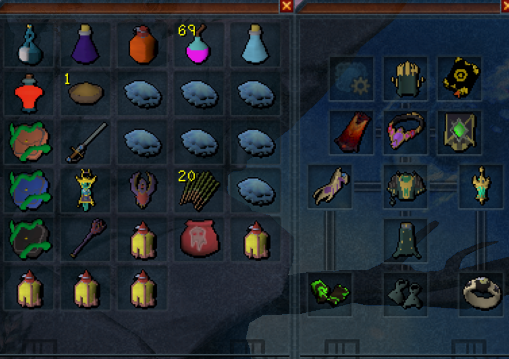
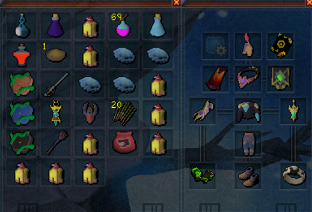

# Hardmode Arch-Glacor Combat Script

A comprehensive hardmode Arch-Glacor combat automation script with consistent performance up to 2500-3000% enrage, featuring efficient rotations and farming strategies.

**Author**: Jared

## Requirements

- **50% Hard Mode Completion**: Must have completed at least 50% of hard mode streaks to unlock necessary doaction
- **Up-to-date MemoryError client**: Requires latest version with updated API functions
- Elder overload potions
- Enhanced Excalibur (augmented supported)
- Vulnerability bombs
- Blue blubbers or similar high-tier food
- Prayer potions/restores

## Features

### Auto-Loot System
The script automatically detects and claims valuable drops from the reward chest:

**Tracked Unique Items:**
- **Frozen core of Leng** (ID: 52020)
- **Glacor core** (ID: 52120)

To modify tracked items, edit the `uniques` table in `/AG/config.lua`:
```lua
-- Line 290-293 in config.lua
uniques = {
    52020, -- Frozen core of Leng
    52120, -- Glacor core
},
```

The script will:
- Automatically check the reward chest for unique drops
- Claim loot based on value thresholds
- Track total rares obtained with runtime statistics

### Performance Features

- **Consistent Rotations**: Streamlined ability sequences that work reliably up to 3000% enrage
- **Balanced Approach**: Optimized balance between DPS and survivability
- **Efficient Banking**: Quick preset loading and supply management
- **Smart Positioning**: Adaptive positioning based on mechanics

### Core Mechanics Handling

- **Arms/Exposed Core**: Automatic target switching and burst damage
- **Glacyte Minions**: Efficient minion clearing
- **Pillars of Ice**: Pillar avoidance with positioning
- **Flurry Phases**: Flurry phase management
- **Frost Cannon**: Beam dodging mechanics

## Installation

1. Place the script in your Lua_Scripts directory:
   ```
   Lua_Scripts/
   ├── Arch-Glacor
   │   ├── AG/
   │   │   ├── main.lua
   │   │   ├── config.lua
   │   │   └── utils.lua
   │   └── README.md
   └── core/
       ├── player_manager.lua
       ├── rotation_manager.lua
       ├── prayer_flicker.lua
       └── timer.lua
   ```

2. Ensure `api.lua` is in the parent directory

## Configuration

### User Settings (`/AG/config.lua`)

Key settings to customize:

```lua
Config.UserInput = {
    -- Banking
    useBankPin = false,
    bankPin = 1234,

    -- Target cycling (important for clean kills)
    targetCycleKey = 0x09,  -- Tab key

    -- Health management
    healthThreshold = {
        normal = {type = "percent", value = 50},
        critical = {type = "percent", value = 25},
        special = {type = "percent", value = 75}  -- Excalibur
    }
}
```

### Buff Management

The script automatically maintains:
- **Elder Overload**: Continuous stat boost
- **Weapon Poison+++**: Poison application
- **Kwuarm Incense Sticks**: Intelligent potency management (max level 4)
- **Powder of Penance**: Prayer point restoration
- **Scripture activation**: Pocket slot items
- **Prism of Restoration**: Automatically heals familiar (hellhound) when on Ancient spellbook - useful for keeping hound alive at low health

### Loot Value Threshold

The script uses interface scanning to determine chest value before claiming. To always claim loot regardless of value, you can modify the claim conditions in `config.lua`.

## Loadout Presets

Two preset configurations are provided:

### Fast Preset


Use this loadout for maximum kills per hour:
- Full DPS gear setup
- Minimal food for emergency situations
- Focus on offensive abilities and perks
- Best for experienced players who know the mechanics
- Prioritizes speed over safety

### Safe Preset


Use this loadout for consistent, safe kills:
- Balanced gear with defensive options
- Extra food and prayer supplies
- Defensive abilities and tank perks
- Ideal for learning or longer sessions
- Prioritizes survival over speed

Choose your preset based on your comfort level and goals. Fast preset maximizes profit per hour, while Safe preset ensures minimal deaths and consistent completions.

## Usage

1. **Setup**: Position at War's Retreat with your chosen preset (Fast or Safe)
2. **Start**: Run the script through the client interface
3. **Monitor**: Watch for unique drops in the metrics display
4. **Stop**: Script auto-stops when out of supplies or manually terminated

### Performance Metrics

The script tracks and displays:
- Kills per hour
- Total rares obtained (with per-hour rate)
- Runtime statistics
- Death count (if applicable)
- Loot value totals

## Advanced Customization

### Adding New Unique Items

To track additional rare drops:

1. Add item ID to `uniques` table:
```lua
uniques = {
    52020, -- Frozen core of Leng
    52120, -- Glacor core
    12345, -- Your new item
},
```

### Modifying Rotations

Edit rotation tables in the `RotationManager` section for different combat styles or strategies.

## Credits
- **Core Framework**: Sonson's player_manager and rotation systems

